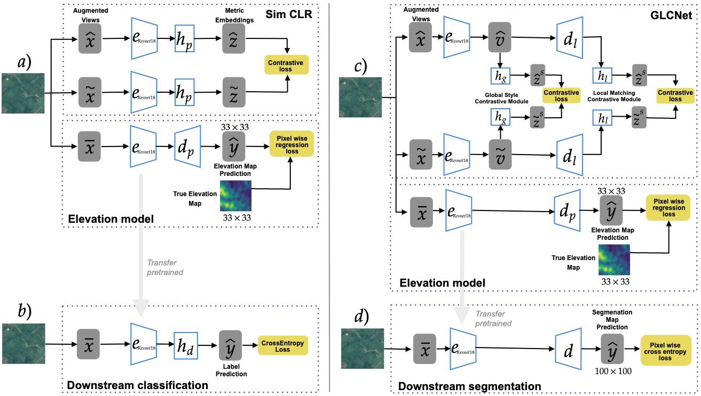

# Enhancing Self-Supervised Learning for Remote Sensing with Elevation Data: A Case Study with Scarce And High Level Semantic Labels

This work proposes a hybrid unsupervised and supervised learning method to pre-train models applied in Earth observation downstream tasks where only a handful of noisy labels denoting very general semantic concepts are available. We combine a contrastive approach to pre-train models with a pixel-wise regression pre-text task to predict coarse elevation maps, which are commonly available worldwide. We hypothesize that this will allow the model to pre-learn useful representations, as there is generally some correlation between elevation maps and targets in many remote sensing tasks. We assess the performance of our approach on a binary segmentation downstream task and a binary image classification task, both derived from a dataset for the northwest of Colombia. In both cases, we pre-train our models with 39k unlabeled images, fine-tune them on the downstream tasks with only 80 labeled images, and evaluate them with 2944 labeled images. Our experiments show that our methods, GLCNet+Elevation for segmentation, and SimCLR+Elevation for classification, outperform their counterparts without the pixel-wise regression pre-text task, namely SimCLR and GLCNet, in terms of macro-average F1 Score and Mean Intersection over Union (MIoU). Our study not only encourages the development of pre-training methods that leverage readily available geographical information, such as elevation data, to enhance the performance of self-supervised methods when applied to Earth observation tasks, but also promotes the use of datasets with high-level semantic labels, which are more likely to be updated frequently.

